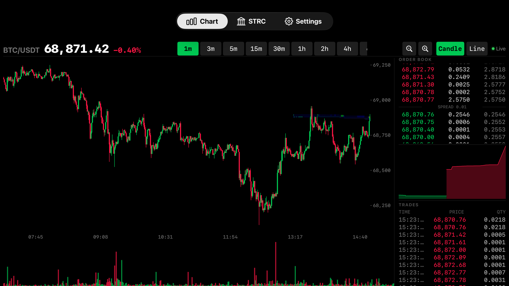
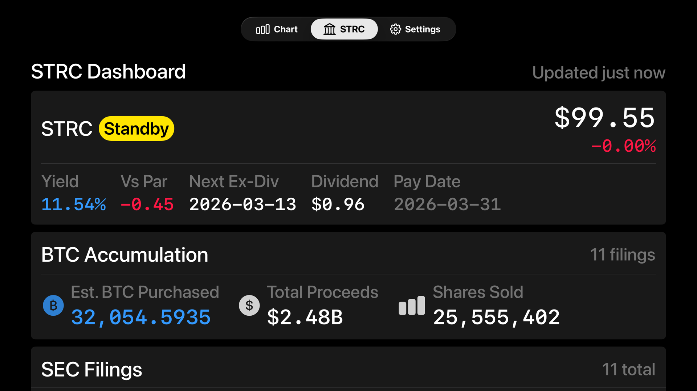
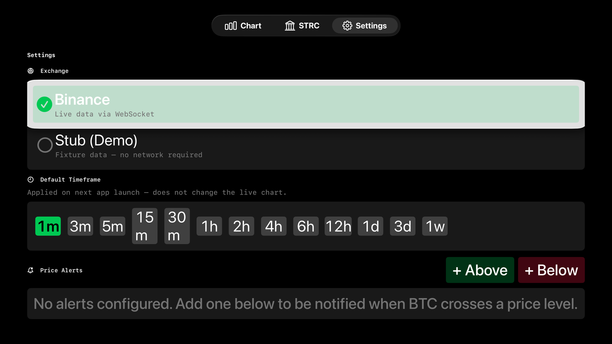

# Bitcoin Terminal

<div align="center">

A real-time Bitcoin trading terminal for Apple TV. Live candlestick charts, order book depth, trade feed, and STRC accumulation dashboard — all running natively on tvOS.


**Quick Start**

```bash
brew install xcodegen && xcodegen generate && open BitcoinTerminal.xcodeproj
```

</div>

---

## TL;DR

**The Problem:** You want to monitor Bitcoin markets from your couch. Existing options are phone apps on a tiny screen, browser-based dashboards that don't work on Apple TV, or janky web wrappers with no native feel.

**The Solution:** A native tvOS app that streams real-time candlestick charts, order book depth, and trade data directly to your TV via Binance WebSocket — designed for the 10-foot viewing distance with Siri Remote controls.

### Why Bitcoin Terminal?

| Feature | What It Does |
|---------|--------------|
| **13 Timeframes** | 1m to 1w candlestick charts, switchable with the Siri Remote |
| **Live Order Book** | 20-level depth ladder, depth chart, and thermal heatmap overlay |
| **Real-Time Trades** | Color-coded buy/sell feed streaming via WebSocket |
| **Price Alerts** | Set above/below thresholds; animated banner when price crosses |
| **STRC Dashboard** | ATM status, BTC accumulation, SEC 8-K filings from strc.live |
| **Crosshair Mode** | Play/Pause to enter; D-pad to explore individual candles |
| **Zero Dependencies** | No third-party charting libraries — 100% SwiftUI Canvas |
| **Demo Mode** | Built-in stub data source for development without network |

---

## Screenshots

### Chart

Live candlestick chart with order book depth ladder, depth chart, and real-time trade feed.



### STRC Dashboard

STRC ticker with ATM status, yield metrics, BTC accumulation summary, and SEC 8-K filings.



### Settings

Switch between live and demo data, configure default timeframe, and manage price alerts.



---

## Design Philosophy

**Canvas over frameworks.** Every chart — candlesticks, volume bars, depth curves, heatmaps — renders to SwiftUI `Canvas` for pixel-perfect control. No UIKit charts, no third-party libraries, no abstractions between your data and the screen.

**Decimal everywhere.** All prices and quantities use `Decimal` arithmetic. JSON decoding goes through `String` intermediaries to avoid `Double` precision loss. Financial data demands it.

**Streams fail independently.** Three separate WebSocket connections (klines, depth, trades) each run in their own `Task`. If depth drops, candles keep updating. If trades lag, the order book stays live.

**Bounded by design.** Ring buffers cap klines at 500, depth snapshots at 500, trades at 100. A 24/7 streaming app cannot grow memory unbounded.

**Protocol-driven data.** `ExchangeDataService` abstracts the exchange. Swap between `BinanceService` (live) and `StubExchangeService` (demo) without touching a single view.

---

## How Bitcoin Terminal Compares

| Feature | Bitcoin Terminal | TradingView (iPad) | Coinbase App | Browser on ATV |
|---------|----------------|--------------------|--------------|----------------|
| Native tvOS app | ✅ | ❌ | ❌ | ❌ |
| Siri Remote controls | ✅ | N/A | N/A | ❌ Poor |
| Live WebSocket candles | ✅ | ✅ | ❌ Delayed | ✅ |
| Order book depth | ✅ 20-level + heatmap | ✅ | ❌ | Varies |
| 10-foot UI optimized | ✅ | ❌ | ❌ | ❌ |
| Offline demo mode | ✅ | ❌ | ❌ | ❌ |
| Price alerts on TV | ✅ | ❌ (mobile only) | ❌ | ❌ |
| No account required | ✅ | ❌ | ❌ | Varies |

**When to use Bitcoin Terminal:**
- You have an Apple TV and want real-time Bitcoin charts on the big screen
- You want order book depth and trade flow visible at a glance
- You track STRC's BTC accumulation via SEC filings

**When it might not be ideal:**
- You need multi-asset portfolios or trading execution
- You want historical data beyond 500 candles
- You need alerts that work when the TV is off

---

## Installation

### Quick Start (Recommended)

```bash
# Install XcodeGen if needed
brew install xcodegen

# Clone and generate
git clone https://github.com/user/tvos-bitcoin-chart.git
cd tvos-bitcoin-chart
xcodegen generate

# Open in Xcode
open BitcoinTerminal.xcodeproj
```

Build and run on the Apple TV Simulator or a physical Apple TV.

### Requirements

- Xcode 16+ with tvOS SDK
- tvOS 17.0+ deployment target
- [XcodeGen](https://github.com/yonaskolb/XcodeGen) for project generation

### Command Line Build

```bash
# Build for simulator
xcodebuild build \
  -scheme BitcoinTerminal \
  -destination 'platform=tvOS Simulator,name=Apple TV'

# Run all 161 tests
xcodebuild test \
  -scheme BitcoinTerminalTests \
  -destination 'platform=tvOS Simulator,name=Apple TV'
```

---

## Siri Remote Controls

| Action | Control |
|--------|---------|
| Switch tabs | Swipe up to reveal tab bar, swipe left/right |
| Navigate timeframes | Swipe left/right on timeframe bar |
| Zoom in/out | Focus zoom buttons in header, click |
| Enter crosshair mode | Press Play/Pause |
| Move crosshair | D-pad left/right |
| Exit crosshair | Press Menu |
| Select settings items | D-pad navigate, click |
| Return to tab bar | Press Menu (when not in crosshair) |

---

## Features

### Chart Tab

**Live Candlestick & Line Charts**
- 13 timeframes: 1m, 3m, 5m, 15m, 30m, 1h, 2h, 4h, 6h, 12h, 1d, 3d, 1w
- Geometric zoom (5 levels, `pow(0.7, level)` scaling)
- Crosshair exploration with OHLCV tooltip overlay
- Volume histogram (bottom 18% of chart area, candle-colored)

**Order Book Intelligence**
- 20-level partial depth from Binance @ 100ms updates
- Compact 7-level bid/ask ladder with cumulative quantities and spread
- Cumulative depth chart (bid/ask curves)
- 2D thermal heatmap behind candlesticks (logarithmic quantity normalization, 6-stop gradient)

**Trade Feed**
- Real-time aggregate trades with timestamp, price, quantity
- Green (BUY) / Red (SELL) color coding
- Ring buffer showing 15 most recent trades

**Axes & Labels**
- Y-axis: auto-scaling tick intervals (10 → 10,000) targeting 4–8 ticks
- X-axis: interval-adaptive formatting (HH:mm intraday, MMM dd for daily+)
- 5% price padding to prevent edge clipping
- Monospaced fonts for 10-foot readability

**Price Alerts**
- Set above/below thresholds (defaults to ±1% from current price)
- Dashed overlay lines on chart canvas
- Animated banner on threshold crossing
- Single-fire with re-arm capability
- Persisted in UserDefaults

**Connection Status**
- Live indicator: Connected / Connecting / Reconnecting / Offline
- Automatic WebSocket reconnection with exponential backoff (up to 60s)
- Three independent streams — one failure doesn't cascade

### STRC Dashboard

- Live ticker from strc.live: price, daily change, extended hours
- ATM status badge (Active when price ≥ $100 par, Standby below)
- Annual dividend yield and vs-par distance
- Next ex-dividend date, amount, pay date
- Total estimated BTC accumulated (computed from `netProceeds / avgBtcPrice`)
- Total proceeds and shares sold
- Top 10 SEC 8-K filings with type badges (ATM / IPO / Follow-On)
- Auto-refresh every 60 seconds while scene is active

### Settings

- **Exchange selection:** Binance (live) or Stub (demo)
- **Default timeframe:** persisted across launches (13 options)
- **Price alerts CRUD:** add above/below, view status (Armed/Fired/Disabled), re-arm, delete

---

## Configuration

```swift
// AppSettings (persisted in UserDefaults)
defaultInterval    // "1m" | "3m" | ... | "1w"
defaultSymbol      // "BTCUSDT"
selectedExchange   // "binance" | "stub"
hasSeenDisclaimer  // true after first launch
```

### Theme Constants

| Token | Value | Purpose |
|-------|-------|---------|
| Background | `#000000` (absolute black) | OLED-optimized |
| Candle green | System green | Bullish candles, buy trades |
| Candle red | System red | Bearish candles, sell trades |
| Data font | Monospaced 22pt | Price labels at 10ft |
| Edge padding | 60pt | tvOS safe area convention |
| Sidebar width | 420pt | Order book + trades panel |
| Volume ratio | 18% | Chart height for volume bars |
| Heatmap opacity | 60% | Depth overlay transparency |

---

## Architecture

```
┌─────────────────────────────────────────────────────────────────────┐
│                          Binance API                                │
│   REST: /api/v3/uiKlines    WS: kline | depth20 | aggTrade        │
└────────────┬──────────────────────┬──────────────────┬──────────────┘
             │                      │                  │
     ┌───────▼────────┐   ┌────────▼───────┐  ┌───────▼────────┐
     │ WebSocket Mgr  │   │ WebSocket Mgr  │  │ WebSocket Mgr  │
     │   (klines)     │   │   (depth)      │  │   (trades)     │
     └───────┬────────┘   └────────┬───────┘  └───────┬────────┘
             │                     │                   │
     ┌───────▼────────┐   ┌────────▼───────┐  ┌───────▼────────┐
     │  KlineStore    │   │ OrderBookStore │  │  TradeStore    │
     │  (500 ring)    │   │  (500 ring)    │  │  (100 ring)    │
     └───────┬────────┘   └────────┬───────┘  └───────┬────────┘
             │                     │                   │
             └─────────┬──────────┘───────────────────┘
                       │
              ┌────────▼─────────┐
              │  ChartViewModel  │──── AlertStore (UserDefaults)
              │  @Observable     │
              └────────┬─────────┘
                       │
        ┌──────────────┼──────────────────────┐
        ▼              ▼                      ▼
  ┌───────────┐  ┌───────────────┐  ┌──────────────────┐
  │ Candle    │  │ OrderBook     │  │ Trades / Depth   │
  │ + Volume  │  │ Ladder        │  │ Chart + Heatmap  │
  │ + Axes   │  │ + Spread      │  │ + Alerts         │
  └───────────┘  └───────────────┘  └──────────────────┘
        All rendered to SwiftUI Canvas
```

```
Sources/
├── App/            # Entry point, ContentView with TabView
├── Models/         # Kline, AggTrade, OrderBookSnapshot, PriceAlert, STRC models
├── Services/       # ExchangeDataService protocol, BinanceService, StubService, STRCService
├── Stores/         # KlineStore, OrderBookStore, TradeStore, AlertStore, STRCStore
├── ViewModels/     # ChartViewModel (orchestrator), STRCViewModel
├── Views/          # All SwiftUI views — Canvas-based chart rendering
├── Theme/          # AppTheme: colors, fonts, layout constants
└── Settings/       # AppSettings (UserDefaults persistence)
```

---

## Data Sources

### Binance

| Endpoint | Type | Purpose |
|----------|------|---------|
| `/api/v3/uiKlines` | REST | Historical candlestick data (up to 1000) |
| `@kline_<interval>` | WebSocket | Live candlestick updates |
| `@depth20@100ms` | WebSocket | Top 20 bid/ask levels, 100ms snapshots |
| `@aggTrade` | WebSocket | Aggregate trade stream |

### strc.live

| Endpoint | Purpose |
|----------|---------|
| `/api/ticker-data` | STRC price, yield, dividend, BTC correlation |
| `/api/sec-filings` | SEC 8-K ATM filing records |

### Stub (Demo)

Deterministic fixture data for offline development: 5 klines, 1 order book snapshot, 1 trade. Always returns `.connected` state.

---

## Tests

161 tests across 12 suites:

| Suite | Coverage |
|-------|----------|
| `KlineTests` | Decoding, price extents |
| `AggTradeTests` | Trade direction, Decimal precision |
| `OrderBookSnapshotTests` | Level parsing, price range |
| `KlineStoreTests` | Historical load, live merge, ring buffer trim |
| `OrderBookStoreTests` | Snapshot append, range computation |
| `TradeStoreTests` | Most-recent-first ordering, trim |
| `AlertStoreTests` | Crossing detection, re-arm, persistence |
| `DepthChartTests` | Cumulative depth level computation |
| `FormatterTests` | NumberFormatter precision |
| `ZoomTests` | Geometric scaling, visible kline clamping |
| `STRCModelTests` | STRC ticker/filing decoding |
| `StubExchangeServiceTests` | Fixture correctness |

```bash
xcodebuild test \
  -scheme BitcoinTerminalTests \
  -destination 'platform=tvOS Simulator,name=Apple TV'
```

---

## Troubleshooting

### "No data loading on chart"

Check your network connection. Binance WebSocket endpoints (`wss://stream.binance.com:9443`) may be blocked in some regions. The connection status indicator in the top-right shows the current state.

### "App stuck on disclaimer screen"

The financial disclaimer shows once on first launch. Click "I Understand" with the Siri Remote. If the button isn't focused, swipe down to reach it.

### "XcodeGen command not found"

```bash
brew install xcodegen
```

### "Build fails with missing tvOS SDK"

Ensure Xcode 16+ is installed with the tvOS platform. In Xcode: Settings → Platforms → download tvOS 17+.

### "Crosshair not responding to D-pad"

Crosshair mode must be activated first by pressing Play/Pause on the Siri Remote. The candle tooltip appears when active. Press Menu to exit.

---

## Limitations

- **BTC only** — hardcoded to BTCUSDT on Binance. No multi-asset or multi-exchange support.
- **No trading** — read-only market data. Cannot place or manage orders.
- **500-candle history** — bounded ring buffer. No infinite scroll or date range queries.
- **No background alerts** — tvOS has no background execution budget. Alerts only fire while the app is active on screen.
- **Single symbol** — STRC dashboard is specific to the Sagittarius Technologies fund.
- **No persistence of chart state** — zoom level, selected timeframe, and crosshair position reset on app relaunch (except default timeframe in Settings).
- **Binance region restrictions** — some countries/ISPs block Binance API endpoints.

---

## FAQ

### Why build this for Apple TV?

A 55"+ OLED is the best monitor you already own. Candlestick charts, depth heatmaps, and order books benefit enormously from screen real estate. And you can watch markets from the couch.

### Does it require a Binance account?

No. It uses Binance's public market data API — no authentication, no API keys, no account needed.

### What is STRC?

Sagittarius Technologies Research Corp — a company that accumulates Bitcoin through At-The-Market (ATM) stock offerings. The STRC tab tracks their SEC filings and BTC acquisition metrics via the strc.live API.

### Can I add other cryptocurrencies?

Not currently. The symbol is hardcoded to BTCUSDT. The `ExchangeDataService` protocol would support it architecturally, but the UI is not built for multi-asset navigation.

### Does the app phone home or track anything?

No analytics, no telemetry, no tracking. The only network calls are to Binance (market data) and strc.live (STRC data). See `PrivacyInfo.xcprivacy` for the full privacy manifest.

### Why no third-party charting library?

Control. tvOS has unique constraints — 10-foot UI, focus engine, Siri Remote input — that generic chart frameworks don't account for. SwiftUI Canvas gives pixel-perfect rendering with native performance.

### How do price alerts work?

Alerts fire when the live price crosses your threshold in the configured direction (above or below). They trigger once, then need re-arming in Settings. Alerts are persisted across launches but only fire while the app is running.

---

## License

MIT
